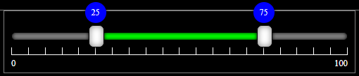
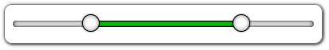

# multi-range-slider-demo

# MultiRangeSlider.vue

## No Dependency only single vue component file

A vue component that accept values in props and return changed values in @input event

| props        | type    | default | description                                                                                                                                                             |
| ------------ | ------- | ------- | ----------------------------------------------------------------------------------------------------------------------------------------------------------------------- |
| min          | Number  | 0       | Slider Minimum Value that user can set                                                                                                                                  |
| max          | Number  | 100     | Slider Maximum Value that user can Set                                                                                                                                  |
| minValue     | Number  | 25      | Slider range selected minimum value that will show default selected                                                                                                     |
| maxValue     | Number  | 75      | Slider range selected maximum value that will show default selected                                                                                                     |
| step         | Number  | 5       | Slider change value that will change when bar clicked or keyboard arrow key pressed                                                                                     |
| preventWheel | Boolean | false   | true then it not accept mouse wheel to change its value. false then (shift + wheel) change minValue (ctrl+wheel) change maxValue, (ctrl+shift+wheel) change both values |

[](./MultiRangeSlider.png "MultiRangeSlider.png")

[](./MultiRangeSlider2.png "MultiRangeSlider2.png")

## How to Install

copy following code and run on CLI

`npm install multi-range-slider-vue`

## How to use

Example Code

[download from gitHub](https://github.com/developergovindgupta/multi-range-slider-vue-demo "download from gitHub")

##usase
**script section**
`import MultiRangeSlider from "multi-range-slider-vue";`

**template sectioln**

    <MultiRangeSlider
            :min="barMin"
            :max="barMax"
            :minValue="barMinValue"
            :maxValue="barMaxValue"
            :step="10"
            @input="UpdateValues"
          />

**data section**

    data() {
        return {
          barMin: 0,
          barMax: 100,
          barMinValue: 10,
          barMaxValue: 90
        };
      },


**methods section**

    methods: {
        UpdateValues(e) {
          this.barMinValue = e.minValue;
          this.barMaxValue = e.maxValue;
        }
      }

### Compiles and hot-reloads for development
```
npm run serve
```

